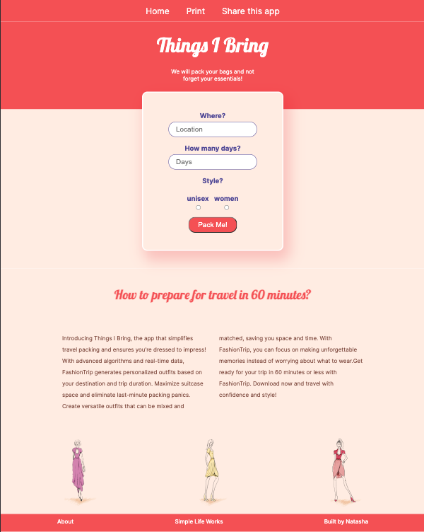
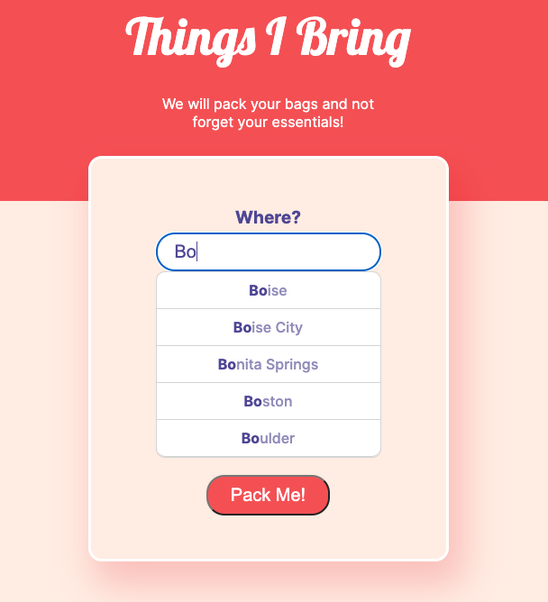
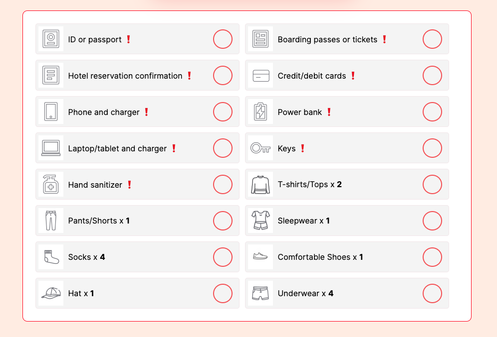

# THINGS I BRING

### [Live Website](https://thingsibring.natasharodic.com/)

#### Natasha Rodic

## 📝 Description

 

Things I Bring - assists individuals in packing for their travels. With just a few inputs like your destination, date, and style, the app generates a complete list of everything you need for your trip. It even uses weather data to suggest appropriate clothing and calculates the number of items you'll need based on the length of your stay. The list is divided into two categories: clothing/items and essential items and features checkboxes so you can keep track of what you've already packed.

---

### Main Screen

### Dropdown Menu

### List of items

---

## 💻 Technologies used

- CSS/HTML
- JavaScript
- Axios for API calls
- Weather API, Coordinates API
- Figma wireframing and Figma high-fidelity
- UX research

---

## Getting started [ ▶️](https://thingsibring.natasharodic.com/)

1. Select your travel destination

2. Specify the duration of your vacation in days

3. Choose your preferred style and click the "Pack Me" button

4. After clicking the "Pack Me" button, you will receive a list of items to bring on your trip, including essentials and non-essentials (clothing), tailored to the weather conditions at your destination. Additionally, for non-essential items, you will be provided with the quantity to bring based on the length of your stay

---

## Next Steps

- Enhance user experience by adding more filters and options to the app

- Consider factors like business trips, number of travelers, packing for children, allergies, medical conditions, etc

- Provide users with tailored recommendations and suggestions based on their specific needs and circumstances
